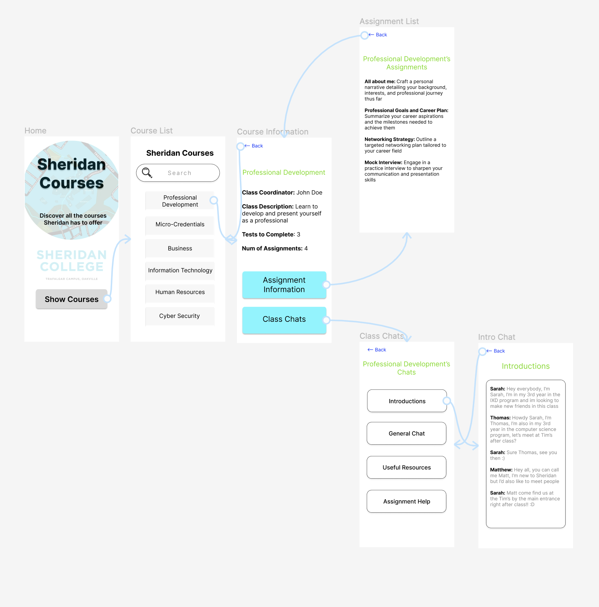

# Sheridan-Courses
Prototype for an intuitive mobile application for courses at Sheridan College designed by Michael Werbowy

# Prototype Versions

Figma URL : [Version 1](https://www.figma.com/file/6OT6BYPEWNN6AVk8uMqAux/Untitled?type=design&node-id=0%3A1&mode=design&t=5v9f0S73LFPs4nOa-1) to see my first ever version of my prototype.

Figma URL : [Version 2]() to see my second and improved version of my prototype.

Youtube URL : [Version 2 of Prototype]()

# About 

This is a Figma prototype based on a Course App for Sheridan students. The application will allow students to see and keep track of their course list and course assignments. Not only that but the prototype also has a proposed built in chat option which will allow students to communicate with their classmates or professors if they encounter any problem with their courses. Each course also displays all it's assignments that take place during the course length.

# Top five new desirable functionlities that I have not seen before in any other apps

1. Private Messaging Options: So far none of the applications I have explored feature user to user private direct messaging functionality. This can be useful when you feel the need to directly speak with someone you met in a group chat for a mutual course.
   
2. Similar Courses: A desirable functionality would be to have a similar course page which can tell the user courses similar to the one they are interested in, this can help to expand the user's search for their desired course path.

3. Built-in Course Specific Reviews+Comments: Adding a custom in-app comment section for each course can be handy so that the user won't need to do their own external research. Keeping it all within the app promotes a full and complete app for all their Sheridan Courses needs. This can help by students who have already completed a course sharing a single tip with fresh students in order to get their head in the game.

4. Gamify The Entire Process: It would atract users for longer periods of time if I were to gamify the process of learning about Sheridan Courses with features such as point systems, achievements, leaderboards and a way to redeem the earned points.

5. Support System: Offer a way for interested students to speak with a more experienced personnel such as an alumni, an upper year student, a tutor, or even maybe a professor in order to learn more about a specific course at Sheridan.

## Initial Prototype

